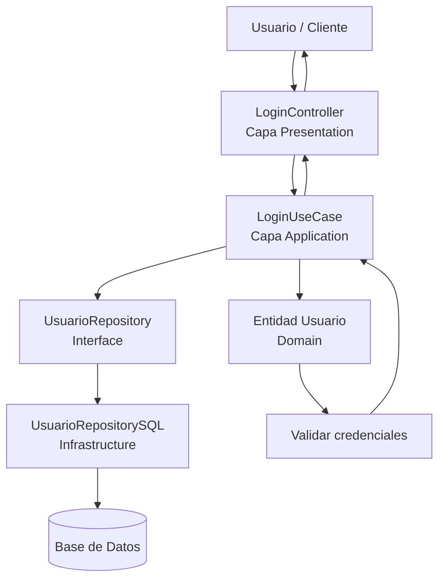

# Diagrama Clean Architecture

```mermaid
flowchart TD

    A[Usuario / Cliente] --> B[LoginController<br/>Capa Presentation]

    B --> C[LoginUseCase<br/>Capa Application]

    C --> D[UsuarioRepository<br/>Interface]

    D --> E[UsuarioRepositorySQL<br/>Infrastructure]

    E --> F[(Base de Datos)]

    C --> G[Entidad Usuario<br/>Domain]

    G --> H[Validar credenciales]

    H --> C

    C --> B

    B --> A
```